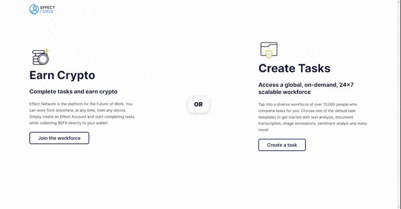

# [Effect Force](https://app.effect.network)

[](https://app.effect.network)

## Production Deploy

The [mainnet](https://app.effect.network) and [testnet](https://testnet.effect.network) versions of the Force are on two different repositories.

```bash

# Add remote, if you haven't added it already!
git remote add prd git@github.com:effectai/force-frontend-prd.git

# Fetch remote info
git fetch

# Switch to branch prd/deploy
git switch deploy

# Merge changes from your branch
git merge <your-branch>

# Push deploy to prd
git push

# Go to Github and make a Pull Request from deploy to mainnet-config
```

## Build Setup

```bash
# install dependencies
$ npm install

# serve with hot reload at localhost:3000
$ npm run dev

# build for production and launch server
$ npm run build
$ npm run start

# generate static project
$ npm run generate
```

## Add Local Version of Effect SDK

1. Clone the GitHub repository: https://github.com/effectai/effect-js/
2. Install & build SDK: ```npm i && npm run build```
3. Link effect-js to local install:

```bash
npm link /path/to/effect-js/
```

When you make changes to the SDK you should run `npm run build:cjs` in that,
after which the force frontend will automatically reload the changes.

## Node version V.14

Node version v14 is required to run the project. If you have nvm installed, you can run `nvm use` to switch to the correct version.

---

## Deployment

there are 2 GitHub actions workflows:

- if you push to the main branch, it will build the static website for mainnet and push it to the `gh-pages` branch. The files on the `gh-pages` branch are served on https://app.effect.network
- if you push to the testnet branch, it will build the static website for testnet (APP_ENV=testnet) and commit all the build files (in /dist) to another repository (effectai/force-frontend-testnet). That repository is set to serve files to testnet.effect.network
main is protected and you cannot directly push to main, so best to first push/make a PR to testnet and from there we make a PR to main
